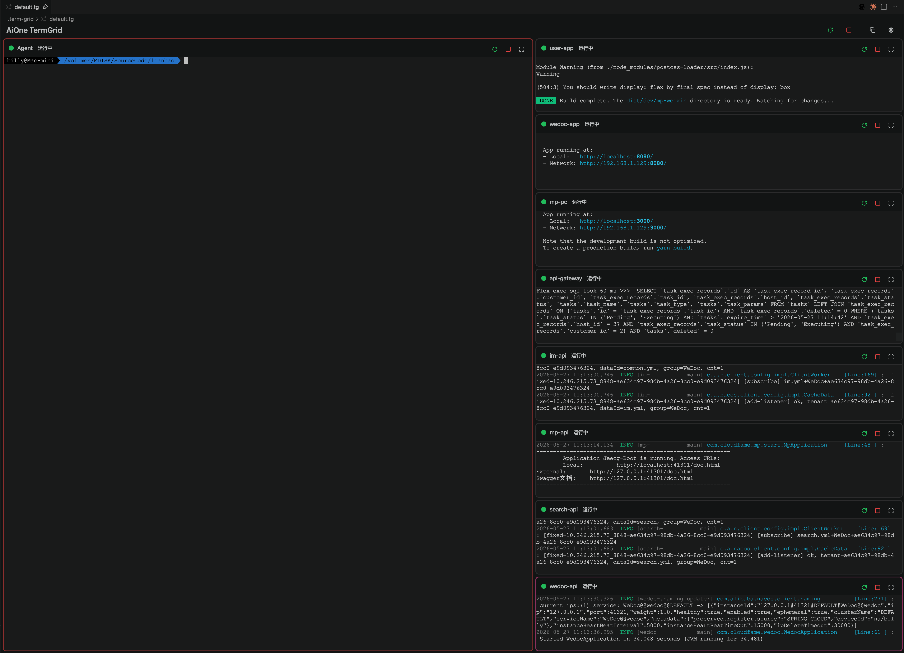
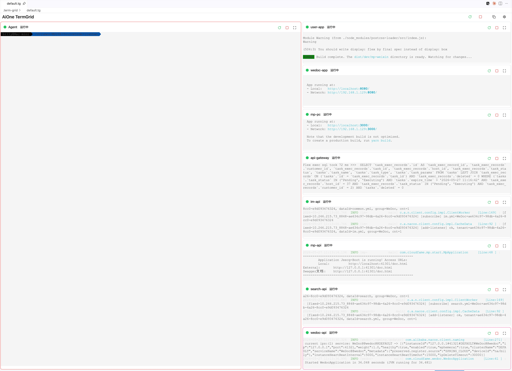
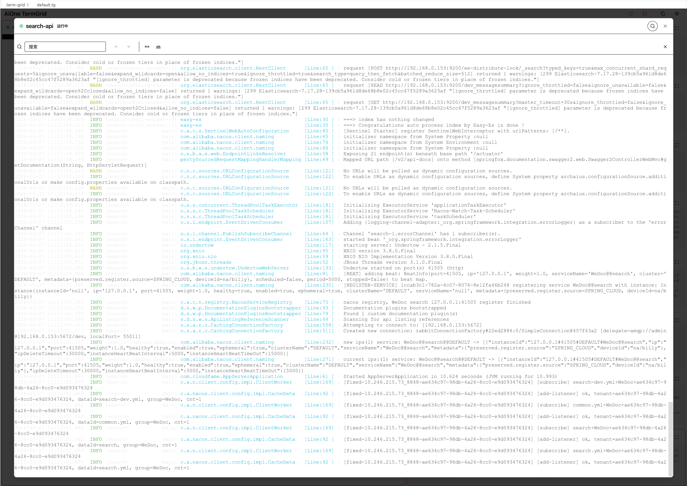
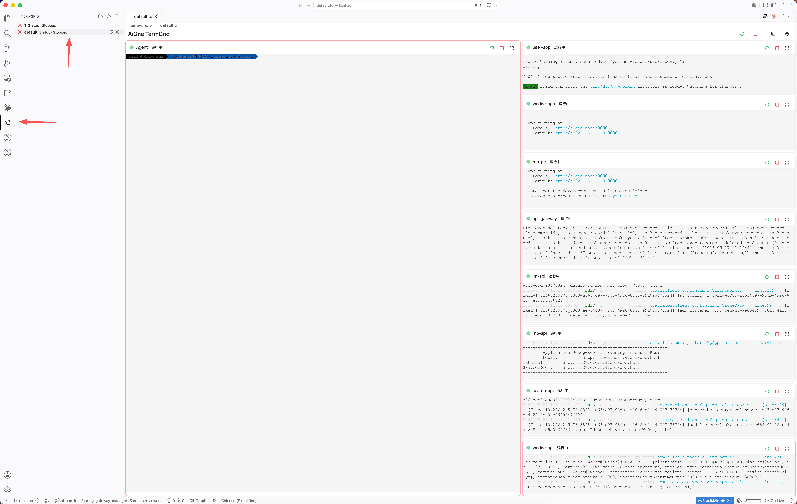
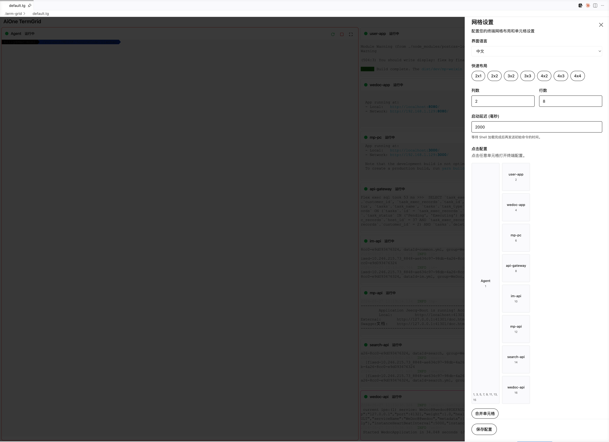
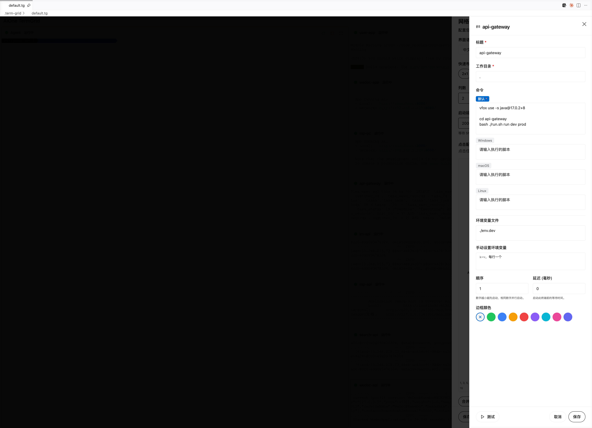
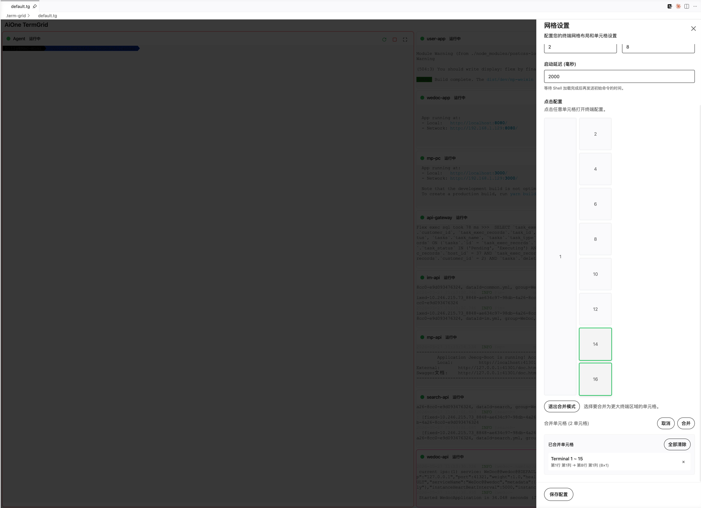
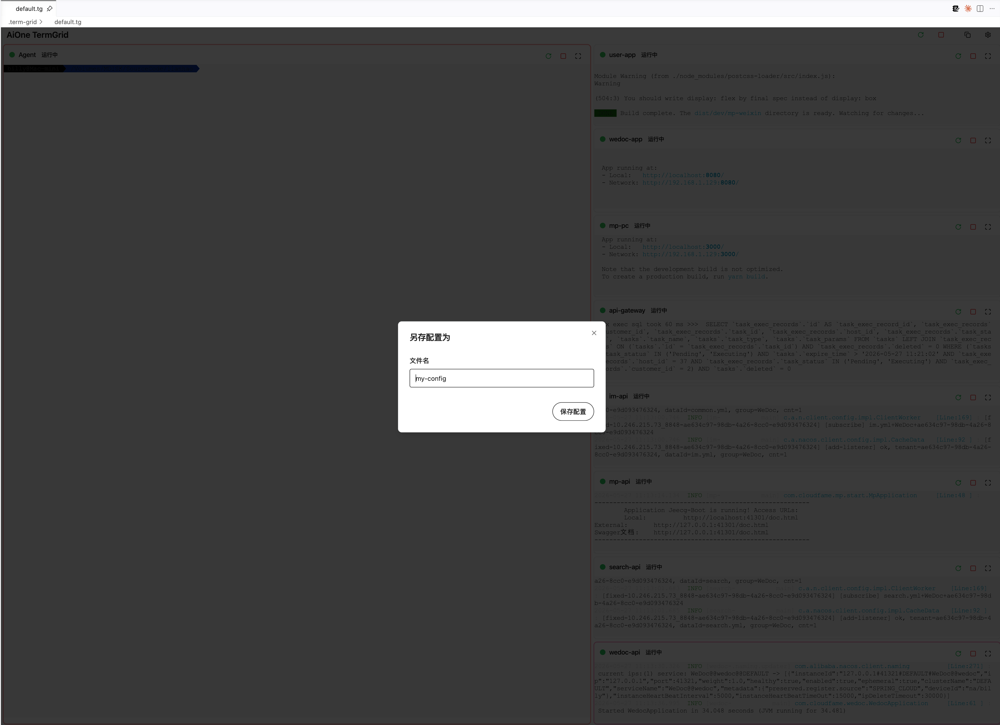

# TermGrid AiOne

批量管理多个终端的插件 - 在网格布局中高效管理多个终端会话

支持 VS Code、Open VSX 和 JetBrains 平台

[中文](./README.md) | [English](./README_en.md)

## 功能特点

- **网格布局** - 自由配置终端网格的行列数（1x1 到 4x4，最多 16 个终端）
- **单元格合并** - 合并多个单元格创建更大的终端区域
- **拖动调整大小** - 拖动行列分割线自由调整单元格大小
- **自定义尺寸** - 通过 `colWidths`/`rowHeights` 精确控制每列/每行的宽度比例
- **主题跟随** - 自动跟随 VS Code 主题切换深色/浅色模式
- **多语言界面** - 支持中文和英文界面
- **终端搜索** - 在放大视图中搜索终端内容（支持大小写敏感、全词匹配）
- **另存为** - 轻松复制配置为新文件
- **批量控制** - 一键启动/停止/重启所有终端
- **平台命令** - 为 Windows/macOS/Linux 配置不同的启动命令
- **环境变量** - 为每个终端自定义环境变量
- **启动顺序** - 支持设置终端启动顺序和延迟

## 截图

### 主界面





### 网格视图



### 终端工具栏



### 设置面板







### 另存为



## 安装

### VS Code Marketplace（推荐）

1. 打开 VS Code
2. 进入扩展市场（`Ctrl+Shift+X`）
3. 搜索 "TermGrid AiOne"
4. 点击安装

### 手动安装

```bash
# 下载 .vsix 文件后
code --install-extension aione-termgrid-0.1.0.vsix
```

### Open VSX Registry

访问 [Open VSX Registry](https://open-vsx.org/extension/AiOne/TermGrid) 进行安装

### JetBrains Marketplace

1. 打开 JetBrains IDE（IntelliJ IDEA、WebStorm、PyCharm 等）
2. 进入 `Settings/Preferences → Plugins → Marketplace`
3. 搜索 "TermGrid AiOne"
4. 点击 Install 并重启 IDE

## 快速开始

### 1. 创建新配置

**方式一：使用命令面板**
- 按 `Ctrl+Shift+P` 打开命令面板
- 输入 `TermGrid: New TermGrid Config`
- 输入配置文件名（仅支持小写字母、数字和连字符）

**方式二：使用侧边栏**
- 点击左侧活动栏的 TermGrid 图标
- 点击右上角的 "+" 按钮
- 输入配置名称

### 2. 配置文件位置

配置文件保存在工作区的 `.term-grid` 文件夹中，文件扩展名为 `.tg`

```
your-project/
├── .term-grid/
│   ├── my-config.tg
│   └── server-config.tg
└── src/
```

### 3. 启动终端

打开 `.tg` 配置文件后，点击右上角的 **重启按钮** 启动所有终端

- **全局重启** - 工具栏的重启按钮启动所有终端
- **单格重启** - 单个格子的重启按钮只启动该终端

### 4. 基本操作

- **调整布局** - 在设置面板中修改行列数
- **合并单元格** - 在设置面板中选择多个格子进行合并
- **放大终端** - 点击右上角的最大化图标放大单个终端
- **搜索内容** - 放大模式下按 `Ctrl+F` 搜索终端内容
- **拖动分割线** - 拖动格子之间的分割线调整大小
- **另存配置** - 点击工具栏的复制图标另存为新文件
- **打开配置目录** - 侧边栏中点击文件夹图标直接打开 `.term-grid` 目录

## 配置说明

### .tg 文件格式

```yaml
name: My Terminal Grid
layout:
  rows: 2
  cols: 2
cells:
  - id: cell-1
    title: Server
    command:
      default: npm run dev
      win32: npm run dev:win
      darwin: npm run dev:mac
      linux: npm run dev:linux
    cwd: .
    env:
      NODE_ENV: development
    delay: 0
    borderColor: '#3b82f6'
  - id: cell-2
    title: Database
    command:
      default: docker-compose up
    cwd: ./docker
    delay: 500
    borderColor: '#10b981'
mergedCells: []
```

### 配置字段说明

| 字段 | 说明 | 示例 |
|------|------|------|
| `name` | 配置名称 | `"My Grid"` |
| `layout.rows` | 行数 (1-4) | `2` |
| `layout.cols` | 列数 (1-4) | `2` |
| `layout.colWidths` | 各列宽度比例（可选） | `[1, 2]` |
| `layout.rowHeights` | 各行高度比例（可选） | `[1, 1]` |
| `cells[].id` | 单元格唯一 ID | `"cell-1"` |
| `cells[].title` | 终端标题 | `"Server"` |
| `cells[].command` | 启动命令 | `{ "default": "npm run dev" }` |
| `cells[].cwd` | 工作目录（相对路径或绝对路径） | `"."` |
| `cells[].env` | 环境变量（可选） | `{ "NODE_ENV": "dev" }` |
| `cells[].delay` | 启动延迟 (ms, 0-300) | `500` |
| `cells[].borderColor` | 边框颜色（可选） | `"#3b82f6"` |
| `cells[].colSpan` | 列跨度（可选） | `2` |
| `cells[].rowSpan` | 行跨度（可选） | `2` |
| `mergedCells[]` | 合并单元格列表 | `[{ "startRow": 0, ... }]` |

### 平台特定命令

```yaml
command:
  default: npm run dev          # 默认命令（必填）
  win32: npm run dev:win        # Windows
  darwin: npm run dev:mac       # macOS
  linux: npm run dev:linux      # Linux
```

### 工作目录

`cwd` 字段支持以下格式：

- `"."` - 工作区根目录
- `"./sub-dir"` - 工作区下的子目录
- `"/absolute/path"` - 绝对路径

### 环境变量

为每个终端单独设置环境变量：

```yaml
env:
  NODE_ENV: development
  PORT: "3000"
```

### 预设边框颜色

| 颜色 | 色值 |
|------|------|
| 绿色 | `#22c55e` |
| 蓝色 | `#3b82f6` |
| 琥珀色 | `#f59e0b` |
| 红色 | `#ef4444` |
| 紫色 | `#8b5cf6` |
| 青色 | `#06b6d4` |
| 粉色 | `#ec4899` |
| 靛蓝色 | `#6366f1` |

## 布局预设

| 预设 | 行x列 | 终端数 |
|------|-------|--------|
| 1x1 | 1x1 | 1 |
| 1x2 | 1x2 | 2 |
| 2x1 | 2x1 | 2 |
| 2x2 | 2x2 | 4 |
| 2x3 | 2x3 | 6 |
| 3x2 | 3x2 | 6 |
| 3x3 | 3x3 | 9 |
| 4x2 | 4x2 | 8 |
| 4x3 | 4x3 | 12 |
| 4x4 | 4x4 | 16 |

## 使用场景

### 全栈开发

```
┌─────────────────┬─────────────────┐
│   Frontend      │    Backend      │
│   npm run dev   │   npm run dev   │
├─────────────────┼─────────────────┤
│   Database      │    Redis        │
│   docker up     │   redis-cli     │
└─────────────────┴─────────────────┘
```

### 微服务开发

```
┌──────────┬──────────┬──────────┐
│ Service1 │ Service2 │ Service3 │
│  :3001   │  :3002   │  :3003   │
└──────────┴──────────┴──────────┘
```

### DevOps 运维

```
┌────────────────┬─────────────────┐
│    Docker      │    K8s          │
│  docker ps     │  kubectl get po │
├────────────────┼─────────────────┤
│    Logs        │    SSH          │
│  tail -f       │  ssh server     │
└────────────────┴─────────────────┘
```

## 终端支持

根据操作系统自动选择终端：

| 平台 | 默认终端 |
|------|---------|
| Windows | PowerShell（优先 pwsh）或 cmd.exe |
| macOS | 用户默认 shell |
| Linux | 用户默认 shell |

## 键盘快捷键

| 快捷键 | 功能 |
|--------|------|
| `Ctrl+F` | 搜索终端内容（放大模式） |
| `Enter` | 下一个搜索结果 |
| `Shift+Enter` | 上一个搜索结果 |
| `Esc` | 关闭搜索/对话框 |

## 系统要求

- **VS Code**: 1.85.0 或更高版本
- **JetBrains**: 2023.1 或更高版本（IntelliJ IDEA、WebStorm、PyCharm 等）
- 支持 Windows、macOS、Linux
- Node.js 18+（仅开发需要）

## 问题反馈

如果您遇到问题或有功能建议，请通过以下方式联系我们：

- GitHub Issues: [https://github.com/ai-one-tech/aione-termgrid/issues](https://github.com/ai-one-tech/aione-termgrid/issues)
- 邮箱: [tech@ai-one.org](mailto:tech@ai-one.org)

## 贡献

欢迎提交 Issue 和 Pull Request！

1. Fork 本仓库
2. 创建特性分支 (`git checkout -b feature/amazing-feature`)
3. 提交更改 (`git commit -m 'Add amazing feature'`)
4. 推送到分支 (`git push origin feature/amazing-feature`)
5. 创建 Pull Request

## 许可证

本项目基于 Apache License 2.0 开源 - 详见 [LICENSE](LICENSE) 文件

## 致谢

- [xterm.js](https://github.com/xtermjs/xterm.js) - 终端组件
- [react-grid-layout](https://github.com/react-grid-layout/react-grid-layout) - 网格布局
- [shadcn/ui](https://ui.shadcn.com/) - UI 组件库
- [VS Code](https://code.visualstudio.com/) - 开发环境
- [JetBrains](https://www.jetbrains.com/) - 开发环境

---

**Made with by [AiOne](https://ai-one.org) | Billy**
